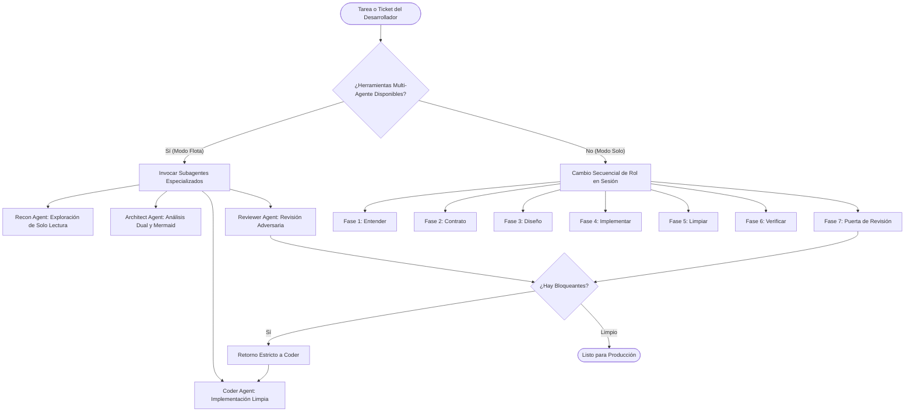

<div align="center">

# ⚒️ Forge

**El Flujo Maestro de Ingeniería de Software para IA Agéntica**

*Arquitectura guiada por evidencias, estándares de código limpio, auditoría de resiliencia backend y revisión por pares adversaria.*

[](LICENSE)
[](phases/)
[](subagents/)
[](references/test-teeth.md)

[English](README.md) | [Español](README.es.md)

</div>

---

## 🌟 ¿Qué es Forge?

**Forge** es un marco de trabajo (*framework*) de ingeniería de software de código abierto y un skill especializado para asistentes de programación con IA (**Google Antigravity**, **Claude Code**, **Cursor**, **Windsurf** y entornos LLM autónomos).

A diferencia de los prompts genéricos de programación que alucinan supuestos, editan código impulsivamente o sufren de sesgo de confirmación, **Forge orquesta una disciplina rigurosa de 7 fases** respaldada por 4 subagentes especializados:

1. **Entender antes de modificar:** Toda afirmación se respalda con un ancla exacta `archivo:línea` y se clasifica como `observed` (observada), `inferred` (inferida), `reported` (reportada) o `unknown` (desconocida).
2. **Arquitectura visual antes de codificar:** Diagrama obligatorio en Mermaid para evitar sobreingeniería y respetar las invariantes existentes.
3. **Código limpio y funciones pequeñas:** Complejidad ciclomática estricta $\le 6$ y consulta obligatoria de documentación oficial antes de memoria (*source-before-memory*).
4. **Resiliencia y división en el punto de commit (*Commit-Point Split*):** Simular fallos antes y después del commit en base de datos para garantizar que los reintentos del cliente no dupliquen datos ni corrompan el estado.
5. **Tests con dientes y mentalidad de mutación:** Un test que nunca falla no protege nada. Se fuerza el fallo en el punto de llamada real (*call site*) antes de dar la tarea por concluida.
6. **Revisión por pares adversaria:** Revisión con ojos frescos en modelos de mayor capacidad (ej. Opus/Pro) y comprobaciones deterministas primero.

---

## 🚀 Ejecución Adaptativa: Modo Flota vs Modo Solo

Forge se adapta dinámicamente a las herramientas de tu entorno:



- **Modo Flota Multi-Agente (Antigravity / Claude Code / Cursor):** Lanza subagentes con contextos limpios. La investigación profunda no satura el contexto principal del orquestador, y la revisión por pares corre en un modelo superior eliminando el sesgo de confirmación.
- **Modo Solo (Agente Único):** Se ejecuta con total fluidez en sesiones estándar de un solo modelo recorriendo cada fase sin dependencias rotas.

---

## 👥 Los 4 Artesanos Especializados (`subagents/`)

| Artesano | Archivo | Rol y Misión Principal |
|---|---|---|
| 🔍 **Recon Agent** | [`subagents/recon-agent.md`](subagents/recon-agent.md) | Exploración de código de solo lectura, rastreo de síntomas a su superficie de cambio y entrega del **Paquete de Evidencias**. |
| 📐 **Architect Agent** | [`subagents/architect-agent.md`](subagents/architect-agent.md) | Análisis de soluciones duales, contratos temporales de estado persistente, control de sobreingeniería y diagramas Mermaid. |
| ⚡ **Coder Agent** | [`subagents/coder-agent.md`](subagents/coder-agent.md) | Implementación con complejidad ciclomática $\le 6$, documentación oficial antes de memoria y refactorización limpia. |
| 🛡️ **Reviewer Agent** | [`subagents/reviewer-agent.md`](subagents/reviewer-agent.md) | Revisor por pares adversario con comprobaciones deterministas primero (linters, tipos, tokens obsoletos), seguido de lentes de seguridad y resiliencia. |

---

## 🔄 Las 7 Fases de la Forja

1. **[01-Understand](phases/01-understand.md):** Delimitar una misión concreta, ubicar puntos de entrada, mapear la superficie de cambio y clasificar afirmaciones.
2. **[02-Contract](phases/02-contract.md):** Definir comportamiento observable mediante escenarios Gherkin, no-objetivos e invariantes.
3. **[03-Design](phases/03-design.md):** Análisis dual de soluciones, desafío de simplicidad y diagrama visual Mermaid.
4. **[04-Implement](phases/04-implement.md):** Construir la solución, reutilizar helpers existentes, tests unitarios y verificar efecto sobre artefacto.
5. **[05-Clean](phases/05-clean.md):** Refactorizar para máxima legibilidad sin expansión de alcance (complejidad $\le 6$).
6. **[06-Verify](phases/06-verify.md):** Endurecimiento, falsificación en el call site, matriz de fallas, seguridad y resiliencia.
7. **[07-Review](phases/07-review.md):** Comprobaciones deterministas, barrido de superficies hermanas, barrido de llamadores y aprobación QA final.

---

## 📚 Manuales Técnicos de Referencia (`references/`)

- 🔒 **[Auditoría de Seguridad](references/security-audit.md):** Cadenas de explotabilidad, aislamiento multi-tenant (`tenant_id`/BOLA), inyecciones SQL/ORM, prevención SSRF (bloqueo de IP privadas) y no exposición de secretos en logs.
- ⚡ **[Resiliencia Distribuida](references/resilience-backend.md):** La regla del **Commit-Point Split** (probar fallos antes y después del commit en BD), timeouts obligatorios en todo I/O, backoff exponencial con jitter e idempotencia segura.
- 🎯 **[Tests con Dientes y Mutación](references/test-teeth.md):** Falsificación en el punto de llamada real, pruebas de mutación mental, modelado de dimensiones y eliminación de la tautología de mocks.
- 🧼 **[Clean Code](references/clean-code.md):** Tamaño de funciones, nombres intencionales, manejo de errores y límites de complejidad.
- 🔎 **[Lentes de Revisión](references/review-lenses.md):** Barrido de valores obsoletos en todo el repo, verificación en líneas no tocadas y dependencias.
- ⚠️ **[Patrones de Falla Comunes](references/failure-patterns.md):** Catálogo de fallas S1 a S11 destilado de sistemas distribuidos reales.

---

## 📦 Instalación y Uso

### 1. En Google Antigravity / Gemini
Clona o copia `forge` dentro de tu directorio de skills:
```bash
git clone https://github.com/JuanCeron023/forge.git ~/.gemini/antigravity/skills/forge
```

### 2. En Claude Code
Agrega `forge` a tu carpeta `.claude/skills/`:
```bash
git clone https://github.com/JuanCeron023/forge.git .claude/skills/forge
```

### 3. En Cursor / Windsurf / Reglas de IDE
Coloca `forge` dentro de `.cursor/rules/` o enlaza `forge/SKILL.md` en las instrucciones de tu proyecto.

---

## 📄 Licencia

Publicado bajo la [Licencia MIT](LICENSE). Creado con artesanía de software por [Juan Cerón](https://github.com/JuanCeron023).
