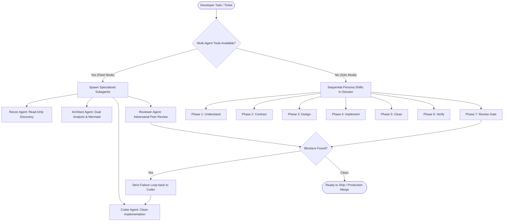

<div align="center">

# ⚒️ Forge

**The Master Software Engineering Workflow for Agentic AI**

*Evidence-driven architecture, clean code standards, backend resilience audits, and adversarial peer review.*

[](LICENSE)
[](phases/)
[](subagents/)
[](references/test-teeth.md)

[English](README.md) | [Español](README.es.md)

</div>

---

## 🌟 What is Forge?

**Forge** is an open-source, evidence-driven software engineering framework and agent skill designed for AI programming assistants (**Google Antigravity**, **Claude Code**, **Cursor**, **Windsurf**, and custom LLM runners).

Unlike generic AI coding prompts that hallucinate assumptions, jump straight to messy edits, or suffer from confirmation bias, **Forge orchestrates a rigorous 7-phase discipline** backed by 4 specialized subagent personas:

1. **Understand Before Modifying:** Every claim is tied to an anchored `file:line` location and classified as `observed`, `inferred`, `reported`, or `unknown`.
2. **Visual Architecture Before Coding:** Mandatory ground-truth Mermaid diagram to prevent overengineering and respect existing invariants.
3. **Clean Code & Small Functions:** Strict cyclomatic complexity $\le 6$ and source documentation before memory.
4. **Resilience & Commit-Point Split:** Forcing faults before and after transactional commits to guarantee caller retry safety and zero state corruption.
5. **Test Teeth & Mutation Mindset:** Tests that never fail protect nothing. Falsify tests at the call site before claiming done.
6. **Adversarial Peer Review:** Review diffs through fresh eyes on higher-capability models (e.g., Opus/Pro) with deterministic checks first.

---

## 🚀 Adaptive Execution: Fleet Mode vs Solo Mode

Forge dynamically adapts to your agentic runtime environment:



- **Multi-Agent Fleet Mode (Antigravity / Claude Code / Cursor):** Spawns isolated subagents with clean contexts. Heavy research won't clutter the main orchestrator's context, and peer reviews run on higher model tiers to eliminate confirmation bias.
- **Single-Agent Solo Mode:** Runs smoothly inside any single-prompt LLM session by stepping sequentially through the phases without broken dependencies.

---

## 👥 The 4 Specialized Artisans (`subagents/`)

| Artisan | Spec File | Role & Primary Mission |
|---|---|---|
| 🔍 **Recon Agent** | [`subagents/recon-agent.md`](subagents/recon-agent.md) | Strictly read-only codebase reconnaissance, traces symptoms to their Change Surface, and returns an anchored **Evidence Packet**. |
| 📐 **Architect Agent** | [`subagents/architect-agent.md`](subagents/architect-agent.md) | Formulates dual solution analyses, models temporal state contracts, challenges premature complexity, and generates visual Mermaid diagrams. |
| ⚡ **Coder Agent** | [`subagents/coder-agent.md`](subagents/coder-agent.md) | Implements scoped features with cyclomatic complexity $\le 6$, consults official documentation before memory, and refactors cleanly. |
| 🛡️ **Reviewer Agent** | [`subagents/reviewer-agent.md`](subagents/reviewer-agent.md) | Adversarial peer reviewer running deterministic checks first (linters, typechecks, stale tokens), followed by security, resilience, and test teeth lenses. |

---

## 🔄 The 7 Phases

1. **[01-Understand](phases/01-understand.md):** Frame one concrete mission, locate entry points, map change surface, and classify claims.
2. **[02-Contract](phases/02-contract.md):** Define observable behavior through Gherkin acceptance scenarios, non-goals, and invariants.
3. **[03-Design](phases/03-design.md):** Dual solution analysis, simplicity challenge, and ground-truth Mermaid diagram.
4. **[04-Implement](phases/04-implement.md):** Build the solution, reuse existing helpers, unit tests, verify effect over artifact.
5. **[05-Clean](phases/05-clean.md):** Refactor for readability without scope creep (cyclomatic complexity $\le 6$).
6. **[06-Verify](phases/06-verify.md):** Hardener verification, falsification at call site, failure matrix, security audit, and resilience.
7. **[07-Review](phases/07-review.md):** Deterministic checks, sibling surface sweep, caller sweep, and adversarial QA sign-off.

---

## 📚 Backend Engineering Reference Manuals (`references/`)

Forge includes production-grade engineering reference manuals:

- 🔒 **[Security Audit](references/security-audit.md):** Exploitability chains, multi-tenant isolation (`tenant_id`/BOLA), SQL/ORM injection escapes, SSRF private IP blocking, and secret logging hygiene.
- ⚡ **[Distributed Resilience](references/resilience-backend.md):** The **Commit-Point Split** rule (testing failures before and after database commits), mandatory I/O timeouts, exponential backoff with full jitter, and idempotent retries.
- 🎯 **[Test Teeth & Mutation](references/test-teeth.md):** Call-site falsification, mental mutation testing, dimension modeling, and eliminating mock tautology.
- 🧼 **[Clean Code](references/clean-code.md):** Pragmatic function sizing, naming patterns, error handling, and complexity limits.
- 🔎 **[Review Lenses](references/review-lenses.md):** Stale value sweep, line-level sibling surface checks, and caller sweeps.
- ⚠️ **[Common Failure Patterns](references/failure-patterns.md):** Catalog of patterns S1 through S11 distilled from real distributed systems failures.

---

## 📦 Installation & Usage

### 1. In Google Antigravity / Gemini Customizations
Clone or copy `forge` directly into your Antigravity skills directory:
```bash
git clone https://github.com/JuanCeron023/forge.git ~/.gemini/antigravity/skills/forge
```

### 2. In Claude Code
Add to your project's `.claude/skills/` or user skills directory:
```bash
git clone https://github.com/JuanCeron023/forge.git .claude/skills/forge
```

### 3. In Cursor / Windsurf / IDE Rules
Place `forge` into your repository's `.cursor/rules/` or reference `forge/SKILL.md` directly in your workspace instructions.

---

## 📄 License

Released under the [MIT License](LICENSE). Built with craftsmanship by [Juan Cerón](https://github.com/JuanCeron023).
